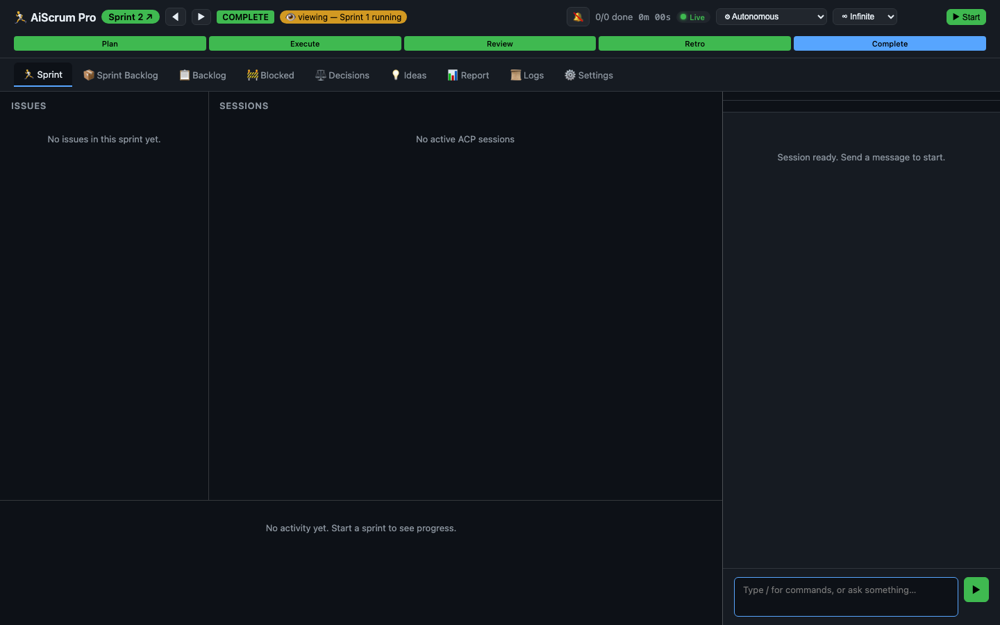
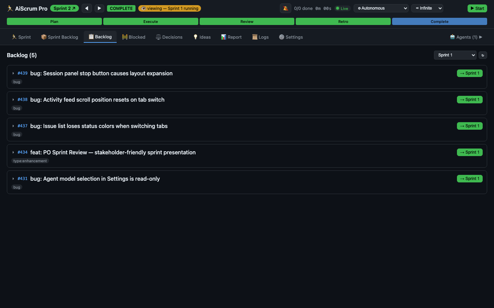
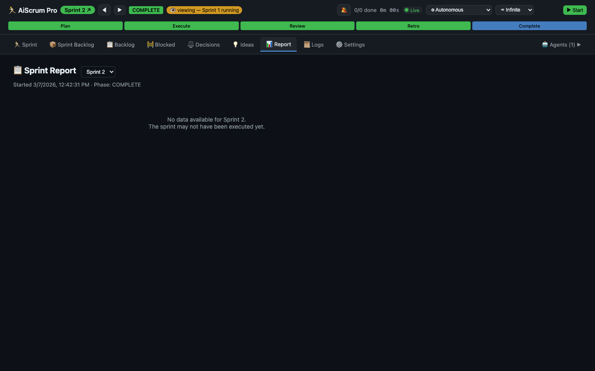
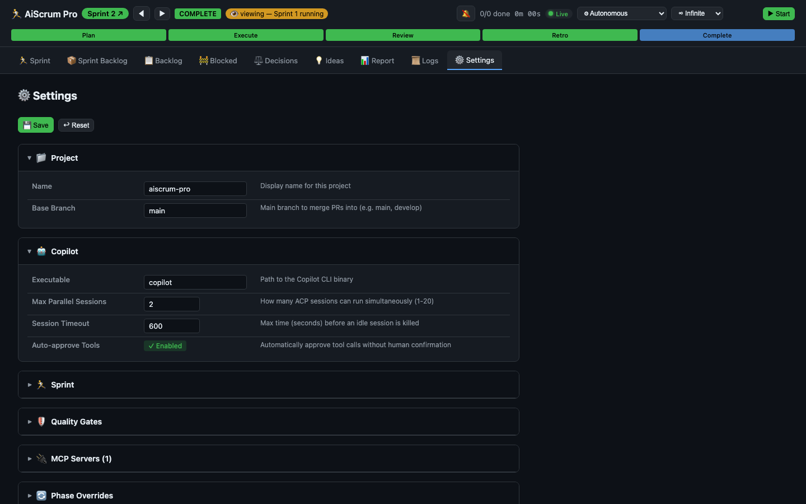
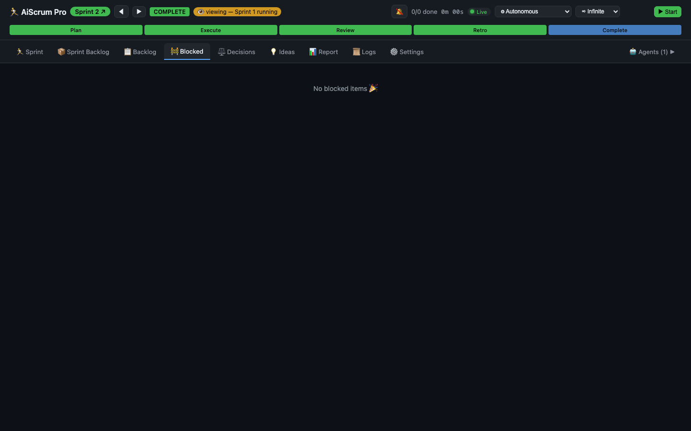
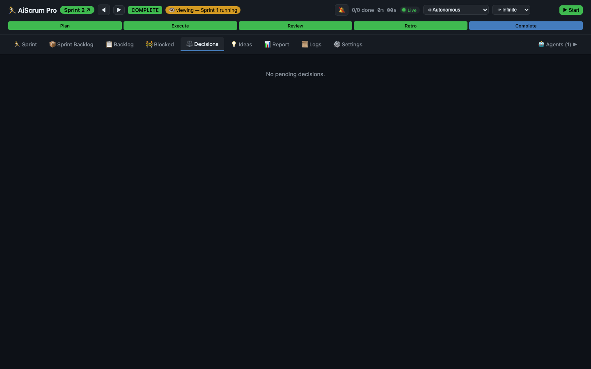
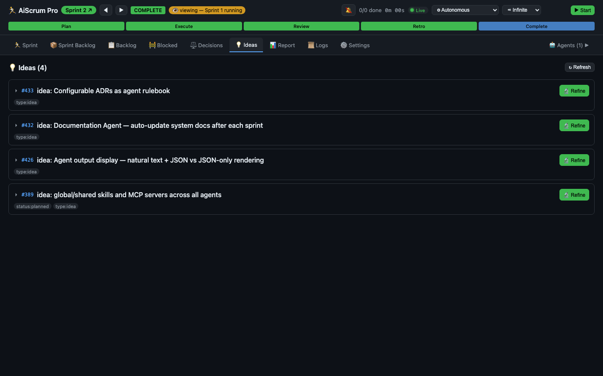
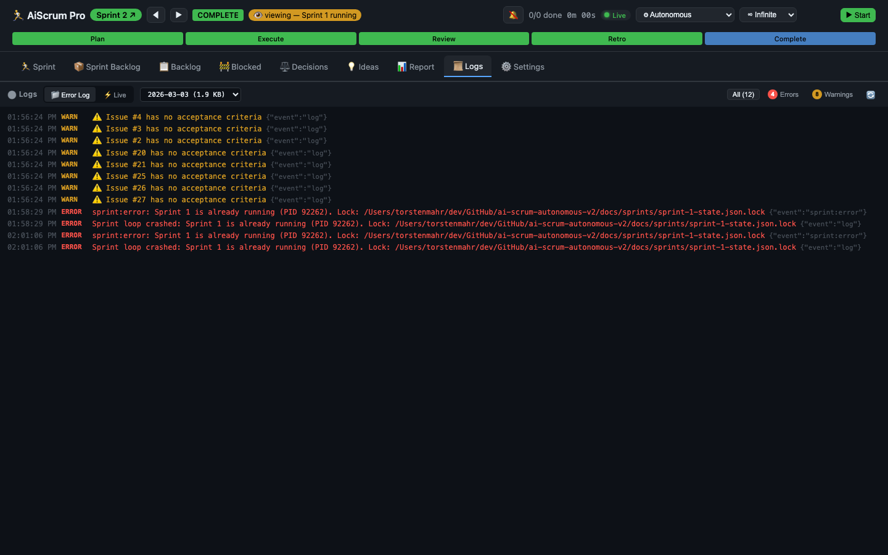

<p align="center">
  <a href="https://trsdn.github.io/aiscrum-pro/">
    
  </a>
</p>

<p align="center">
  <strong>An autonomous AI team that runs full Scrum sprints — planning, coding, testing, reviewing — while you sleep.</strong>
</p>

<p align="center">
  <a href="https://trsdn.github.io/aiscrum-pro/"></a>
  <a href="https://docs.github.com/en/copilot"></a>
  <a href="LICENSE"></a>
  <a href="https://nodejs.org"></a>
  <a href="https://www.typescriptlang.org"></a>
</p>

---

AiScrum Pro is the **runtime engine** for the [AI-Scrum Framework](https://trsdn.github.io/ai-scrum/) — an open-source methodology for human-AI collaboration built on real Scrum principles.

Where the framework defines the *what* (roles, ceremonies, boundaries, manifesto), AiScrum Pro is the *how* — a TypeScript engine that orchestrates GitHub Copilot CLI via the Agent Client Protocol to execute sprints autonomously.

**You are the Stakeholder.** You set direction, drop ideas, and review deliverables. The AI team handles everything else — refinement, planning, parallel execution, quality gates, code review, sprint retros, and continuous process improvement.

## What Makes This Different

This isn't a chatbot wrapper or a prompt template. It's a **full AI development team** with structure, boundaries, and accountability.

| | Ad-hoc AI Coding | AiScrum Pro |
|---|---|---|
| **Planning** | None — chat until it works | ICE-scored sprint backlog, milestone grouping |
| **Execution** | One issue at a time, manually | Parallel workers via git worktrees, auto-merge |
| **Quality** | "It should work" | 7 enforced gates: tests, lint, types, build, scope, diff-size, review |
| **Memory** | Lost every session | Sprint logs, velocity tracking, issue comments, ADRs |
| **Scope control** | Feature chasing | Drift detection, sprint lock, escalation model |
| **Improvement** | Static | Every retro improves the process itself |

> Built on the [AI-Scrum Manifesto](https://trsdn.github.io/ai-scrum/): *Autonomous execution* over constant approval. *Verified evidence* over claimed completion. *Sprint discipline* over feature chasing.

## The Sprint Cycle

Five ceremonies, fully automated. Start a sprint and come back to finished work.

```
 ┌─────────┐    ┌──────────┐    ┌───────────┐    ┌──────────┐    ┌─────────┐
 │ Refine  │───▶│   Plan   │───▶│  Execute  │───▶│  Review  │───▶│  Retro  │
 │         │    │          │    │           │    │          │    │         │
 │ Ideas → │    │ ICE score│    │ Parallel  │    │ Velocity │    │ Process │
 │ Issues  │    │ Scope    │    │ Workers   │    │ Metrics  │    │ Improve │
 └─────────┘    └──────────┘    └───────────┘    └──────────┘    └─────────┘
                                  ↕ Quality Gates enforced after every issue
```

- **Refinement** — Stakeholder drops ideas, AI researches and decomposes into concrete issues with acceptance criteria
- **Planning** — AI triages backlog, ICE-scores issues, selects sprint scope, assigns milestones
- **Execution** — Parallel workers implement issues in isolated git worktrees, each gated by tests + lint + types + build + code review
- **Review** — Sprint metrics, velocity tracking, deliverable summary for stakeholder acceptance
- **Retro** — What went well, what didn't, process improvements applied to agents and workflows

## Web Dashboard

Real-time sprint control center. Monitor progress, chat with agents, navigate sprint history.

| Sprint Board | Product Backlog |
|:---:|:---:|
|  |  |

| Sprint Report | Settings |
|:---:|:---:|
|  |  |

| Blocked Issues | Decisions Pending |
|:---:|:---:|
|  |  |

| Ideas Inbox | Logs |
|:---:|:---:|
|  |  |

**9 views**: Sprint Board · Sprint Backlog · Product Backlog · Blocked · Decisions · Ideas · Sprint Report · Logs · Settings

## Guardrails & Controls

Autonomous execution needs boundaries. AiScrum Pro has them built in.

🔒 **Drift Control** — Sprint scope is locked. Discovered work goes to backlog, not into the current sprint. If >2 unplanned issues appear, the engine escalates.

⚖️ **Escalation Model** — The AI decides *how*, never *what*. Strategic direction changes, ADR modifications, scope changes, and dependency additions always require stakeholder approval.

🛡️ **Quality Gates** — 7 checks enforced on every issue: tests exist, tests pass, lint clean, types clean, build passes, scope drift check, diff size limit.

🏛️ **Challenger Agent** — An adversarial reviewer that challenges assumptions and finds blind spots before sprint review.

📋 **Definition of Done** — Acceptance criteria before coding. Tests that verify behavior. PR reviewed. CI green. Issue closed with summary. No shortcuts.

## Quick Start

### Prerequisites

- **Node.js** ≥ 20
- **GitHub Copilot CLI** with ACP support — `copilot --acp --stdio`
- **`gh` CLI** authenticated — `gh auth login`

### Install & Run

```bash
# Install dependencies + setup git hooks
npm install

# Launch web dashboard (auto-detects sprint from milestones)
npx tsx src/index.ts web
```

The dashboard opens at `http://localhost:9100` with live sprint status, issue tracking, and agent chat.

### Test Mode

Run AiScrum Pro against dummy issues without affecting your real backlog:

```bash
make test-setup      # Create test data (milestones + issues)
make test-web        # Launch dashboard in test mode
make test-cleanup    # Remove all test artifacts when done
```

## CLI Commands

```bash
aiscrum web                             # Launch web dashboard
aiscrum full-cycle --sprint 3           # Run complete sprint: refine → plan → execute → review → retro
aiscrum execute-issue --issue 42        # Execute a single issue
aiscrum plan --sprint 3                 # Sprint planning only
aiscrum check-quality --branch feat/x   # Run quality gates on a branch
aiscrum refine                          # Refine ideas into actionable issues
aiscrum review --sprint 3               # Sprint review ceremony
aiscrum retro --sprint 3                # Sprint retrospective
aiscrum metrics --sprint 3              # Sprint velocity & metrics
aiscrum drift-report                    # Scope drift analysis
aiscrum pause / resume                  # Pause/resume execution
aiscrum status                          # Active worker status
```

## Configuration

Everything is config-driven. One YAML file controls the entire sprint engine. Ready-to-use examples for **[TypeScript](examples/typescript/)**, **[Python](examples/python/)**, **[React](examples/react/)**, and **[Go](examples/go/)** — just copy and go:

```bash
cp -r examples/python/.aiscrum .aiscrum    # Pick your stack
$EDITOR .aiscrum/config.yaml               # Set project name
```

```yaml
# .aiscrum/config.yaml — Zod-validated at startup
project:
  name: "my-project"
  base_branch: "main"

sprint:
  prefix: "Sprint"
  max_issues: 8
  enable_challenger: true

copilot:
  max_parallel_sessions: 4
  phases:
    planner:  { model: "claude-opus-4.6" }
    worker:   { model: "claude-sonnet-4.5" }
    reviewer: { model: "claude-opus-4.6" }

quality_gates:
  require_tests: true
  require_lint: true
  require_types: true
  require_build: true
  max_diff_lines: 300

git:
  auto_merge: true
  squash_merge: true
```

## Architecture

```
┌──────────────────────────────────────────────────┐
│                 Web Dashboard                     │
│  Sprint Board · Backlog · Chat · Sessions · Logs  │
└────────┬───────────────────────────┬──────────────┘
         │ WebSocket                 │ REST API
┌────────┴───────────────────────────┴──────────────┐
│              Dashboard Server                      │
│  Event Bridge · Issue Cache · Chat Manager          │
└────────┬───────────────────────────────────────────┘
         │ SprintEventBus
┌────────┴───────────────────────────────────────────┐
│              AiScrum Pro — Sprint Engine            │
│  init → refine → plan → execute → review → retro   │
├─────────────┬──────────────┬───────────────────────┤
│ Ceremonies  │ Enforcement  │ Infrastructure         │
│ · Planning  │ · Quality    │ · ACP Client           │
│ · Execution │ · Drift      │ · Git Worktrees        │
│ · Review    │ · Escalation │ · GitHub API (gh CLI)   │
│ · Retro     │ · Challenger │ · Sprint Docs           │
└─────────────┴──────────────┴───────────────────────┘
         │ Agent Client Protocol (ACP)
┌────────┴───────────────────────────────────────────┐
│          GitHub Copilot CLI (copilot --acp)         │
└────────────────────────────────────────────────────┘
```

## The AI-Scrum Framework

AiScrum Pro implements the [AI-Scrum Framework](https://trsdn.github.io/ai-scrum/) — an open-source methodology for human-AI software development.

**Core values from the [AI-Scrum Manifesto](https://trsdn.github.io/ai-scrum/):**

- **Autonomous execution** over constant approval
- **Verified evidence** over claimed completion
- **Sprint discipline** over feature chasing
- **Continuous process improvement** over static workflows

**The operating model is simple:**

```
  ┌─────────────┐                    ┌──────────────────────┐
  │ Stakeholder │◀──── Decisions ────│                      │
  │   (Human)   │──── Direction ────▶│  AI Team (AiScrum)   │
  │             │                    │  · Lead Agent (PO+SM)│
  │ Sets goals  │◀── Deliverables ──│  · Worker Agents     │
  │ Reviews work│                    │  · Challenger Agent  │
  │ Has veto    │                    │  · Reviewer Agent    │
  └─────────────┘                    └──────────────────────┘
```

The AI decides *how* to implement. The human decides *what* to build. Strategic decisions always escalate. Scope never drifts without approval.

Read the full framework: **[trsdn.github.io/ai-scrum](https://trsdn.github.io/ai-scrum/)**

## Development

```bash
make check         # Lint + types + tests
make fix           # Auto-fix lint + format
make test          # Run all tests (vitest)
make test-quick    # Fast fail (--bail 1)
make coverage      # Tests with coverage report
make build         # Build TypeScript
make security      # Security scan
```

Git hooks are installed automatically on `npm install`:
- **pre-commit**: format check + lint + typecheck (~15s)
- **pre-push**: full gate including tests + build (~60s)

## Documentation

| Document | Description |
|----------|-------------|
| [AI-Scrum Framework](https://trsdn.github.io/ai-scrum/) | The conceptual foundation — manifesto, operating model, ceremonies |
| [Overview](docs/OVERVIEW.md) | Architecture deep-dive and component documentation |
| [Deployment](docs/DEPLOYMENT.md) | Installation, configuration, and production setup |
| [Contributing](CONTRIBUTING.md) | How to contribute — branching, testing, PR process |
| [Process Constitution](docs/constitution/PROCESS.md) | Full development process — ceremonies, DoD, ICE scoring, labels |
| [Philosophy](docs/constitution/PHILOSOPHY.md) | Values and principles |
| [ADRs](docs/architecture/ADR.md) | Architectural Decision Records |
| [Examples](examples/) | Ready-to-copy `.aiscrum/` configs for TypeScript, Python, React, Go |
| [Changelog](CHANGELOG.md) | Version history |

## License

[MIT](LICENSE) — Built with ❤️ by the AiScrum Pro team (human + AI, working as one).
